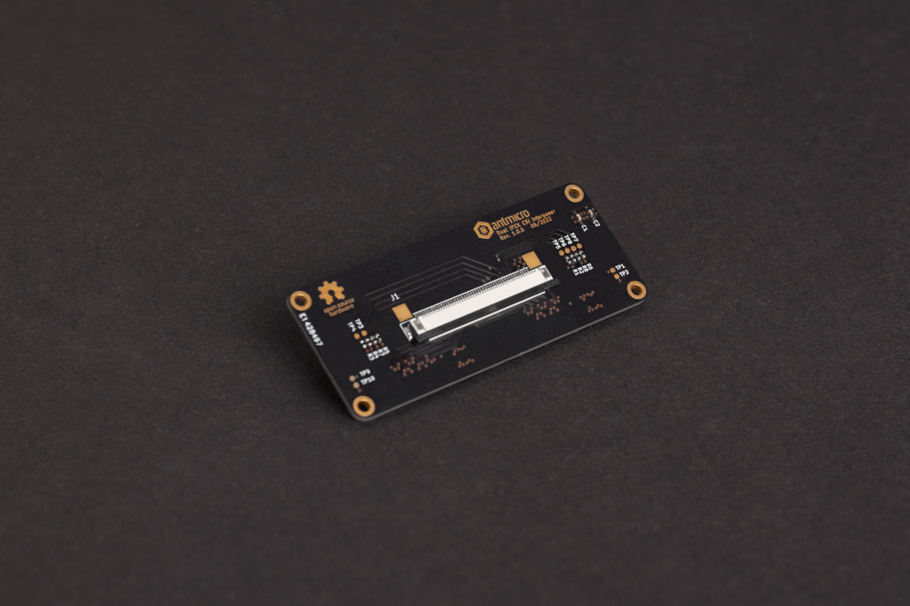

# Dual I-PEX CSI Interposer

Copyright (c) 2022 [Antmicro](https://www.antmicro.com)

## Overview

This repository contains open hardware design files for the Dual I-PEX micro-coaxial CSI Interposer.
The board serves as a 2-to-1 CSI-2 camera cable adapter.

It features two 30-pin I-PEX camera connectors including 4-lane MIPI CSI-2 interface with I2C and power supply as well as a single upstream connector - 50-pin FFC, compatible with video processing boards created by Antmicro such as:

* [TX2 Deep Learning Platform](https://github.com/antmicro/jetson-tx2-deep-learning-platform) supporting NVIDIA Jetson TX2 
* [AGX CSI Adapter](https://github.com/antmicro/jetson-nano-baseboard) supporting NVIDIA Jetson Xavier AGX and NVIDIA Jetson Orin AGX
* [Jetson Nano Baseboard](https://github.com/antmicro/jetson-nano-baseboard) supporting NVIDIA Jetson Nano, Jetson Xavier NX, Jetson TX2 NX
* [AMD-Xilinx Kria K26 Devboard](https://github.com/antmicro/kria-k26-devboard)
* [Antmicro's Snapdragon 625 baseboard](https://github.com/antmicro/snapdragon-625-baseboard)
* [Antmicro's Snapdragon 845 baseboard](https://github.com/antmicro/snapdragon-845-baseboard)

## Repository structure

The main repository directory contains KiCad PCB project files, a [LICENSE](LICENSE), and a README.
The remaining files are stored in the following directories:

* `lib` - contains the component libraries,
* `doc` - contains the adapter [schematics](doc/dual-ipex-csi-interposer.pdf),
* `img` - contains the board visualization.

## Key features

* 50-pin dual CSI-2 FFC connector (host side),
* twin 30-wire I-PEX micro coax CSI-2 connectors (camera side) (interface compatible with the [Framos CSI Adapter](https://github.com/antmicro/framos-csi-adapter)),
* 4-lane CSI-2 MIPI per camera.

## License

[Apache-2.0](LICENSE)
